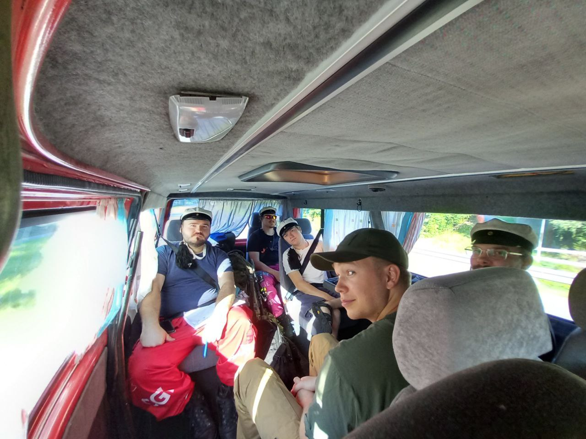
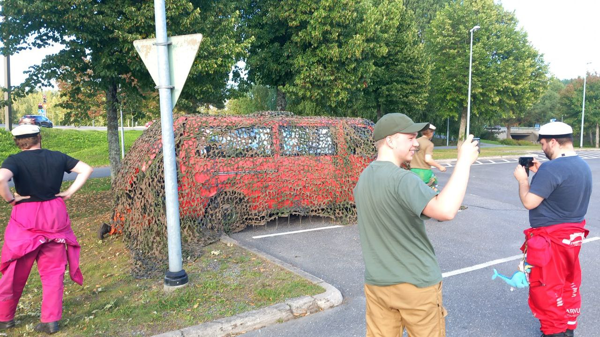

+++
fragment = "content"
weight = 100
#background = ""
categories = ["Lateres", "Kesäoperaatio", "2024"]

title = "Kesäoperaatio 2024 1/3"
#subtitle = ""
title_align = "left"

date = "2024-08-22"
display_date = true

summary = """
Markkinoiden halvin taistelupaita toimii hyvin kesäisenä ampumaratapäivänä. “Taistelupaita” nimi kuitenkin hämää, sillä tämä tuote soveltuu hieman kehnosti taisteluihin. Paita ei ole palosuojattu, toisin kuin...
"""

[asset]
image = "2024-RMY-Kesaoperaatio-04748.jpg"

+++

### Kesäoperaatio 2024 1. päivä
**9.8.2024**  
Oli perjantai 9. elokuuta ja istuskelin LUT Buffassa syömässä. Kello näytti puolta päivää ja mietiskelin että mitähän tarviin mukaan lateresin kesäpäiville. Muistellessa edellistä vuotta pöytäseuran kanssa, tulin(tirsk) päätökseen että parasta varautua keskiverto maailmanloppuun. Tarvitsisin mukaan taisteluvarusteet ampumaradalle ja läjän tykkejä joilla kisata. Toki majoitus tulisi olemaan mökillä mallia improvisoitu niin makuupussi ja alusta ovat ehdottomat. Tärkeimpänä kuitenkin oli saada reissulle mukaan jokin ajopeli, sillä tulisimme ajamaan viikonlopun aikana ristiin rastiin pitkin etelä-savoa. 

Sain lainaan firmalta -96 vuoden t4 syncro portterin jolla pystyisi kyyditsemään 9 henkeä maailman ääriin. Ehtona toki oli että hitsaisin pakoputken ennen reissua. Lounaan jälkeen päätin hurautta tallille ja soittaa hieman miggiä ennen lähtöä. Laittelin pari postimerkkiä pelkääjän oven alla olevaan mutkaan joka hieman hillitsi 2.4 litraisen voimakoneen ääniä. Uskoin että matkalaiset arvostaisivat tätä vaikka itse ehkä salaa nautin niistä. Lisäksi vaihoin takarenkaat jotka olivat ottaneet työmaalla osumaa itseensä.

Kun menopeli oli varmistettu ja tankattu hurautin upseerikerholle pakkaamaan sekä kaluston että miehistön kyytiin. Valitettavasti meidän aikamääreet eivät toteutuneet ja jouduin tekemään kunniakierroksen keskustan kautta ennen kuin pääsimme marssikäskyssä määrätylle aloitustasalle LUT yliopiston pääovien eteen. Kävimme ovien edessä läpi kesäpäivien varomääräykset jotka olivat hyvin ankarat. Käsittelisimmehämme useita eri a-tarvikkeita pitkin viikonloppua. Kun puheet oli pidetty ja kuvat otettu todistusaineistoon pääsimme lähtemään moottorimarssille.

Reittimme kulki Lappeenrannasta tietä 13 kohti Mikkeliä. Olin marssikäskyssä antanut tähän kohtaan marssitauon ja toteutimme sen vierailemalla paikallisessa elintarvikeliikkeessä, olihan taistelijoilla jano. Halusimme pitää operaation piilossa desanteilta, joten ajoimme HPA:n parkkipaikan reunaan pistoon. Olimme varautuneet tähän ja peittelimme ajoneuvon naamioverkoilla jottei uteliaat silmät sitä huomaisi takana olevasta floorasta ja faunasta. Valitettavasti omat operaattorimme jotka suorittivat alueella toista operaatiota onnistuivat spottaamaan meidät ja jouduimme pitämään tauon lyhyenä. Onnistuimme kuitenkin täydentämään ruoka & juoma varastot. Tärkeimpänä oli 70cl nestemäinen lahjus jota tarvittaisiin seuraavana päivä polttoaineeksi.

Tauon jälkeen jatkoimme matkaa kohti länttä jossa muistelujen mukaan kokoontumispiste pitäisi sijaita. Noin 30-60min(riippuu keneltä kysytään) kestoisen kurvailun jälkeen pysäytin pakun seesteisen rantamökin pihalle. Oli aika aloittaa alueen valtaaminen ja sen linnoittaminen omiin tarkoituksiin. Osastomme tiesi mitä pitää tehdä. Aivan kuin se olisi tullut jostain selkärangasta tai sitä olisi vuosia harjoiteltu. Voi myös olla että kyseessä on osa suomalaista taistelijan genetiikkaa… sauna ja grilli leimahtivat välittömästi tulille ja jaloimmat saaliseläimet lätkäistiin grilliin makkaran muodossa. Oli aika aloittaa Kesäpäivät.

Kursiokapteenin loki